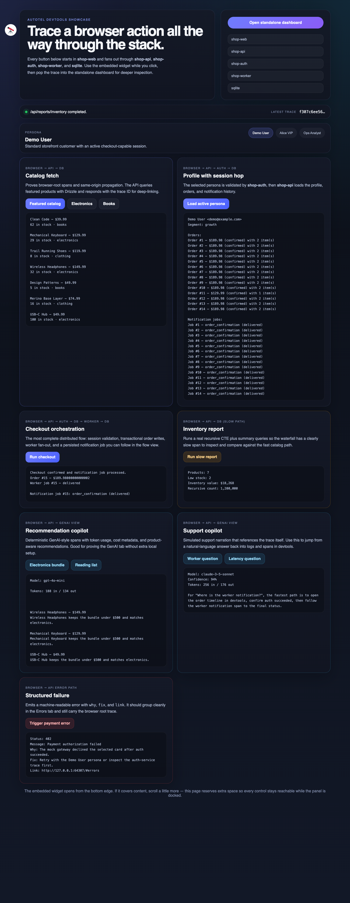
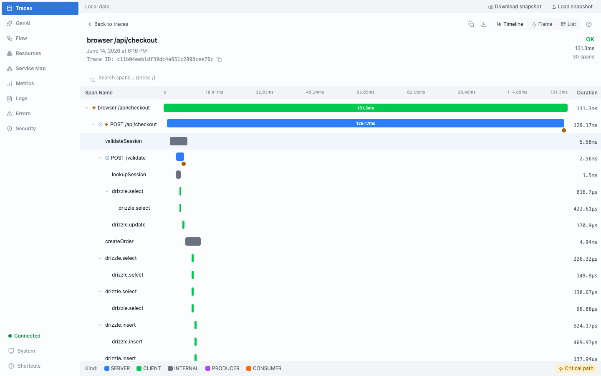
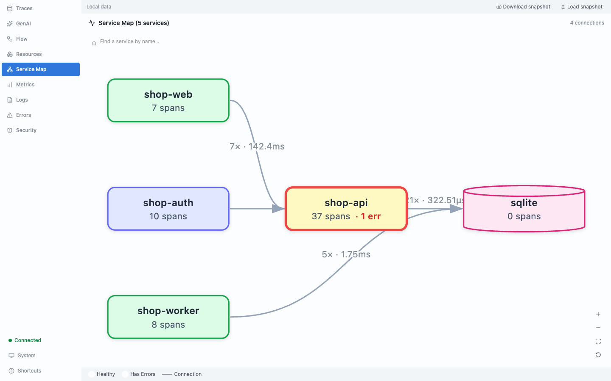

# Autotel Devtools Showcase

This example is the definitive `autotel-devtools` demo in `apps/`. It shows a browser-originated trace flowing through a Hono API, an auth service, a worker service, and shared Drizzle-backed SQLite state, with both the embedded widget and the standalone dashboard active at the same time.

## Preview

Walkthrough video:

- [Showcase walkthrough (`.webm`)](./assets/showcase-walkthrough.webm)

Web app with embedded widget entry point:



Standalone dashboard:



Service map after browser -> API -> auth/worker flows:



## What it demonstrates

- Browser tracing with `autotel-web`, including `traceparent` and W3C `baggage` propagation.
- A standalone `autotel-devtools` dashboard plus the embedded widget in the web app.
- A real multi-service topology: `shop-web` -> `shop-api` -> `shop-auth` / `shop-worker` -> `sqlite`.
- Drizzle spans from multiple services sharing the same schema and database.
- Request-scoped logging via `useLogger()` inside Hono handlers.
- Structured API errors using `createStructuredError()`.
- Slow-query style traces via the inventory report route.
- Deterministic GenAI-style spans without requiring external model setup.

## Architecture

```text
browser (shop-web)
  -> shop-api
     -> sqlite
     -> shop-auth -> sqlite
     -> shop-worker -> sqlite

autotel-devtools
  <- OTLP spans/logs from browser + all services
  -> standalone dashboard
  -> embedded widget script
```

## Services

- `shop-web`
  Runs in the browser and starts the trace for each showcase action.
- `shop-api`
  Serves the UI and owns the primary catalog, profile, checkout, report, GenAI, and error flows.
- `shop-auth`
  Validates showcase session tokens from the shared database.
- `shop-worker`
  Persists and completes notification jobs so checkout shows a real downstream hop.
- `sqlite`
  Shared Drizzle database used by API, auth, and worker services.

## Quick start

From the repo root:

```bash
pnpm install
pnpm --filter @jagreehal/example-devtools db:push
pnpm --filter @jagreehal/example-devtools start
```

The start script builds `autotel-devtools` and `autotel-web`, seeds the SQLite database, starts the devtools server, then launches the API, auth, and worker services as separate processes.

Default URLs:

- Web app: `http://127.0.0.1:3000`
- Standalone dashboard: printed at startup
- Widget script: printed at startup

The devtools port is auto-selected by default so the showcase does not collect telemetry from unrelated local apps that may already be exporting to the standard OTLP development port.

Ports are configurable with:

- `AUTOTEL_DEVTOOLS_PORT`
- `API_PORT`
- `AUTH_PORT`
- `WORKER_PORT`

## Showcase flows

Use the cards in the web UI to generate traces that are easy to inspect in the dashboard.

1. `Featured catalog`
   Browser -> API -> SQLite
2. `Load active persona`
   Browser -> API -> Auth -> SQLite
3. `Checkout featured bundle`
   Browser -> API -> Auth -> SQLite -> Worker -> SQLite
4. `Run slow inventory report`
   Browser -> API -> SQLite with a slow recursive CTE
5. `Recommendation copilot`
   Browser -> API with deterministic GenAI attributes
6. `Support copilot`
   Browser -> API with deterministic GenAI attributes
7. `Trigger structured error`
   Browser -> API returning `message`, `why`, `fix`, `link`, and `code`

## Personas and baggage

The browser app ships with three personas:

- `Demo User`
- `Alice Johnson`
- `Ops Analyst`

Switching persona updates W3C baggage fields such as `tenant.id`, `shop.persona`, and `shop.segment`, so server spans can be filtered and correlated by tenant and user segment.

## What to inspect in devtools

- `Traces`
  Start with `shop-web browser /api/checkout` or `shop-web browser /api/users/1`.
- `Service Map`
  Confirms the end-to-end topology across browser, API, auth, worker, and SQLite.
- `Flow`
  Shows the request fan-out and downstream worker hop clearly.
- `GenAI`
  Shows model/provider/token attributes for the recommendation and support flows.
- `Errors`
  Shows the structured payment error with remediation fields.

## Implementation notes

- The browser exports telemetry through the same-origin `/v1/traces` proxy exposed by `shop-api`. This keeps the browser setup simple and preserves browser-root traces in the dashboard.
- Server-to-server hops use `injectTraceContext()` from `autotel/http` when calling `shop-auth` and `shop-worker`. This injects the W3C `traceparent` (and baggage) into the outbound `fetch`, so downstream services continue the same trace instead of starting new roots. Without it, the auth and worker calls would appear as disconnected traces and the Service Map would not link the services.
- Every traced business function passes an explicit span name to `trace()` (for example `trace('createOrder', (ctx) => ...)`). Explicit names keep the waterfall readable and survive bundler minification, rather than relying on call-stack name inference.
- Static assets and the trace proxy endpoint are excluded from API telemetry so the dashboard stays focused on the showcase flows.
- The example uses direct package builds from the monorepo, so it is intended to be run from this repository rather than copied as a standalone app.
