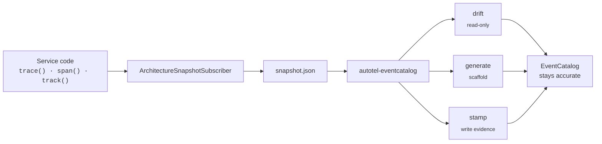

# example-eventcatalog

## EventCatalog, kept honest by your tests

A four-service e-commerce checkout instrumented with [autotel](https://github.com/jagreehal/autotel).
The committed [EventCatalog](https://www.eventcatalog.dev) describes the intended architecture;
a test-run snapshot records what actually ran, and CI fails any PR where those two disagree.



[autotel](https://github.com/jagreehal/autotel) | [autotel-eventcatalog](../../packages/autotel-eventcatalog) | [EventCatalog](https://www.eventcatalog.dev)

---

## The problem this solves

EventCatalog goes stale. An engineer adds an event in code and forgets to update
the catalog. A team deprecates a producer and the diagram still shows it. A new
field appears in payloads and nobody documents it. Six months later, engineers
stop trusting the catalog.

The teams using the catalog keep asking:

- *"Is this event still in production? When was it last fired?"*
- *"Did someone add a field nobody declared in the schema?"*
- *"Which producer still emits this event nobody consumes?"*
- *"Did the LLM token cost change since last release?"*
- *"Does the catalog match what the code does at runtime?"*

---

## Get started in 30 seconds

```bash
pnpm install
cd apps/example-eventcatalog
pnpm test                    # 4 tests pass, contract verified
pnpm services:snapshot       # writes services/test/snapshot.json
pnpm catalog:drift           # diffs snapshot vs catalog
```

Real output from this repo:

```text
$ pnpm test

 ✓ test/snapshot-fieldstats.integration.test.ts (1 test) 24ms
 ✓ test/checkout.integration.test.ts (3 tests) 24ms

 Test Files  2 passed (2)
      Tests  4 passed (4)
   Duration  791ms
```

```text
$ pnpm catalog:drift

# Architecture drift report
_Snapshot from `example-eventcatalog` at 2026-05-22T00:00:00.000Z_

No drift detected. Catalog and runtime agree.
```

That is the steady state. Any later finding is real divergence to investigate.

---

## How autotel makes this work

One top-level `trace()` per use case. One `.track()` where the event is
emitted. Schema, producer, consumers, and channel all live inside the
payload:

```typescript
import { trace } from 'autotel';
import { orderPlacedEvent } from '../shared/events';

export const placeOrder = trace((ctx) => async (order) => {
  ctx.setAttribute('order.customer_id', order.customerId);
  ctx.setAttribute('order.value_cents', order.totalCents);

  await db.orders.insert(order);
  await kafka.publish('orders.events', { type: 'OrderPlaced', ...order });

  orderPlacedEvent.track({
    orderId: order.id,
    customerId: order.customerId,
    totalCents: order.totalCents,
    currency: order.currency,
    items: order.items,
    shipping: order.shipping,
    metadata: order.metadata,
    _autotel: {
      channel: 'orders.events',
      producer: 'OrdersService',
      consumers: ['PaymentService', 'RecommendationsService'],
    },
  });

  return order;
});
```

Three primitives:

| Primitive | What it captures |
| --- | --- |
| `trace()` | Top-level span per use case, plus span attributes |
| `span()` | Nested I/O (e.g. `payment.capture` retries, `wms.reserve`) |
| `defineEvent(...).track()` | Typed domain event with a declared schema |

The `_autotel` payload key is the bridge to EventCatalog. The channel,
producer, and consumer list become the catalog's architecture-graph edges.

> **At the broker boundary.** Production services swap that bare
> `kafka.publish(...)` for `traceProducer({ system, destination })` (and
> `traceConsumer` on the receiving side) so trace context propagates as
> message headers. The `placeOrder` shape stays the same; one extra wrapper
> sits at the wire. See [`services/src/orders/index.ts`](services/src/orders/index.ts)
> for the production form.

---

## Typed events with Zod: the schema is the contract

`services/src/shared/events.ts` defines every domain event with `defineEvent`
and a Zod schema:

```typescript
import { defineEvent } from 'autotel';
import { z } from 'zod';

export const orderPlacedEvent = defineEvent(
  'order.placed',
  z.object({
    orderId: z.string(),
    customerId: z.string(),
    totalCents: z.number(),
    currency: z.string(),
    items: z.array(z.object({
      sku: z.string(),
      quantity: z.number(),
      priceCents: z.number(),
    })),
    shipping: z.object({ addressId: z.string() }),
    metadata: z.object({ source: z.string() }),
    _autotel: z.object({
      channel: z.string(),
      producer: z.string(),
      consumers: z.array(z.string()).optional(),
    }),
  }),
  { toJsonSchema: (schema) => z.toJSONSchema(schema) },
);
```

One declaration covers three checkpoints:

- **Compile time:** TypeScript catches structural drift before the code runs.
- **Runtime:** `safeParse` validates payloads before they emit.
- **CI:** `ArchitectureSnapshotSubscriber` carries the JSON Schema into the
  snapshot, so `autotel-eventcatalog generate` writes the same schema your
  code enforces. No inference guesswork.

---

## What gets captured

After a test run, `services/test/snapshot.json` describes the whole architecture:

```text
5 events captured:
  inventory.reserved        5×  producer=InventoryService     channel=inventory.events
  order.placed              7×  producer=OrdersService        channel=orders.events
                                consumers=[PaymentService, RecommendationsService]
  payment.captured          5×  producer=PaymentService       channel=payments.events
  payment.failed            2×  producer=PaymentService       channel=payments.events
  recommendation.generated  5×  producer=RecommendationsService channel=orders.events
```

For every event, `fieldStats` records the runtime type and sample values per
dotted path:

```json
"order.placed": {
  "fieldStats": {
    "currency":             { "types": ["string"], "sampleValues": ["GBP"] },
    "customerId":           { "types": ["string"], "sampleValues": ["customer-0", "customer-1"] },
    "items[].priceCents":   { "types": ["number"], "sampleValues": [3000, 5499] },
    "items[].sku":          { "types": ["string"], "sampleValues": ["sku-101", "sku-202"] },
    "metadata.source":      { "types": ["string"], "sampleValues": ["web"] }
  }
}
```

The catalog uses this to detect schema drift, value drift, and type drift.
The data comes from one test run, with no manual annotation.

---

## What drift looks like when it fires

Inject a field nobody declared (e.g. add `_drift_demo_field` to a
recommendation payload) and `pnpm catalog:drift` reports it:

```text
# Architecture drift report

## Field-path drift

### `recommendation.generated`

**Extra fields in payloads (not in declared schema):**

- `_drift_demo_field`

Drift detected in current snapshot.
```

The exit code is non-zero, the PR fails, and the author sees the sticky comment
and updates the catalog.

What gets caught:

| Drift class | Example finding |
|---|---|
| **Events observed but undocumented** | `order.cancelled` emitted by code; no entry in catalog |
| **Events documented but never observed** | `LegacyEvent` in catalog; never seen in tests |
| **Field-path drift (extra)** | `personalization_seed` in payload; not declared in schema |
| **Field-path drift (missing)** | `customerId` declared in schema; never present in payloads |
| **Type drift** | `amount` declared `number`; observed `string` |
| **Value drift (enum mismatch)** | `status: "placed"` observed; schema enum excludes it |
| **Services observed but undocumented** | `OrdersService` is a producer; no service page |
| **Channels observed but undocumented** | `orders.events` carries messages; no channel page |

---

## The contract test

The whole architecture stands on one integration test that locks autotel's
capture to the catalog's claims:

```typescript
// services/test/checkout.integration.test.ts
beforeAll(() => {
  init({
    service: 'example-eventcatalog',
    subscribers: [snapshot],
  });
});

it('captures every event the CheckoutFlow page claims to observe', async () => {
  await placeOrder(sampleOrder);
  await Promise.all([handleOrderPlaced(msg), generateRecommendation(msg)]);
  await handlePaymentCaptured(...);

  const snap = snapshot.toSnapshot();
  expect(Object.keys(snap.events).sort()).toEqual([
    'inventory.reserved',
    'order.placed',
    'payment.captured',
    'recommendation.generated',
  ]);
});
```

A second test, `services/test/snapshot-fieldstats.integration.test.ts`,
asserts the deeper claim: `fieldStats` actually capture types and sample
values.

```typescript
expect(snap.events['order.placed'].fieldStats?.totalCents?.types)
  .toContain('number');
expect(snap.events['order.placed'].fieldStats?.currency?.sampleValues)
  .toContain('GBP');
```

If autotel stops capturing those runtime types and sample values, the
test fails, which surfaces as a broken test in the catalog package itself.

A third test, `services/test/catalog-drift.integration.test.ts`, runs the
same drift the CLI runs and asserts the catalog and the committed snapshot
agree. Any new catalog entry that nobody exercises, or any service that
stops emitting a documented event, fails CI here before the
`pnpm catalog:drift` script gets a chance to.

---

## Coverage discipline

Drift only sees what your test suite exercises. The committed snapshot is
the artefact of one run of `build-snapshot.ts`; a payload field that only
appears under a code path your tests skip will not show up in `fieldPaths`
or `fieldStats`, and an event that only fires under a rare production
condition will not appear at all.

In practice this gives you **catalog honesty for what your test suite
covers**. Two consequences:

1. **Adding a new documented event is a two-step change.** Add it to the
   catalog, *and* extend `services/src/build-snapshot.ts` so a test run
   emits it. If you only do step one, `catalog-drift.integration.test.ts`
   fails with `documentedButUnseen` and the message tells you to run
   `pnpm services:snapshot`.
2. **Edge cases in the demo are deliberate.** `walkFailedCheckout` in
   `build-snapshot.ts` exists so the snapshot covers `payment.failed`
   alongside the happy path. When you add a new edge case in real
   services, add the analogous walk to your own `build-snapshot.ts` and
   keep the coverage discipline honest.

The drift test is the gate; the snapshot script is where you spend the
effort to broaden coverage. Treat them as a pair, not a one-time setup.

---

## Walk the catalog

```bash
pnpm catalog:dev
```

Open <http://localhost:3000>.

| URL | What it shows |
|---|---|
| [`/docs/flows/CheckoutFlow/1.0.0`](http://localhost:3000/docs/flows/CheckoutFlow/1.0.0) | Happy-path checkout with evidence callouts at every step |
| [`/docs/flows/PaymentRecoveryFlow/1.0.0`](http://localhost:3000/docs/flows/PaymentRecoveryFlow/1.0.0) | Failure path: declined payment, retry budget, recovery email |
| [`/docs/events/RecommendationGenerated/1.0.0`](http://localhost:3000/docs/events/RecommendationGenerated/1.0.0) | An event page with runtime evidence stamped between markers |
| [`/visualiser/domains/E-Commerce/1.0.0`](http://localhost:3000/visualiser/domains/E-Commerce/1.0.0) | The full architecture rendered as a node graph |

The evidence callouts on each page (counts, last-seen, sample values) come
from `autotel-eventcatalog stamp` writing between idempotent markers in the
mdx. Run it whenever the snapshot refreshes:

```bash
pnpm catalog:stamp           # writes evidence blocks
pnpm catalog:stamp:dry       # preview without writing
```

---

## Wire it into CI

The package ships a composite GitHub Action. One step gates every PR:

```yaml
# .github/workflows/eventcatalog-drift.yml
- run: pnpm install --frozen-lockfile
- run: pnpm services:snapshot       # or whatever produces your snapshot

- uses: jagreehal/autotel-eventcatalog@v0
  with:
    snapshot: ./services/test/snapshot.json
    catalog: ./catalog
    base-ref: origin/${{ github.base_ref }}
    fail-on-drift: true
    comment-on-pr: true
```

What lands on the PR:

- A sticky comment titled *"Architecture drift: what this change introduces"*
- The check fails only when the PR introduces *new* drift; pre-existing drift
  is reported for context but does not block
- The drift report is also written to `$RUNNER_TEMP/autotel-eventcatalog-drift.md`
  and printed in the job log

---

## Watch it live

```bash
pnpm services:live
```

Open <http://localhost:4000>. The dashboard shows:

- **Event tiles** with counts ticking up as each checkout completes
- **An activity feed** scrolling new events the instant they fire
- **Channel-coloured badges** showing producer / consumer attribution
- **A `payments.failed` tile** appearing once the first card decline lands
- **A drift banner** firing ~25 seconds in, when the runner introduces a
  `_drift_demo_field` into recommendation payloads
- **A mock PR view** at <http://localhost:4000/demo/pr> showing what the
  drift report looks like when it lands on a real PR

For repeatable demos, regression tests, or CI runs that need a stable event
stream, replay a committed session:

```bash
REPLAY_PATH=services/test/demo.jsonl pnpm services:live
```

The dashboard sees the same SSE stream as a live run, with no PSP calls and
no random order generation.

---

## Where to read the code

Start with these three files, in this order:

1. **`services/src/shared/events.ts`** defines every domain event once with `defineEvent` + Zod, including the `_autotel` metadata that wires the catalog edges.
2. **`services/src/orders/index.ts`** is the pattern to copy: `trace`, `traceProducer`, and `track` colocated. Every other service follows this shape.
3. **`services/test/checkout.integration.test.ts`** shows how the snapshot subscriber wires into `init()` and locks the contract.

The [`autotel-eventcatalog` package README](../../packages/autotel-eventcatalog)
covers the full loop: code, snapshot, drift, GitHub Action, stamped catalog.

---

## Roadmap

| Step | Status | Output |
|---|---|---|
| 1. Hand-curate the destination catalog | done | the `catalog/` you see |
| 2. `ArchitectureSnapshotSubscriber` in `autotel-subscribers` | done | `services/test/snapshot.json` from a real test run |
| 3. `autotel-eventcatalog` drift diff + CLI | done | `pnpm catalog:drift` reports real findings |
| 4. `autotel-eventcatalog generate` scaffolding | done | services / events / channels + producer↔event↔channel edges generated from snapshot |
| 5. Live HTTP+SSE dashboard | done | `pnpm services:live` → real-time updates at :4000 |
| 6. Snapshot-vs-base PR comparison + GitHub Action | done | `.github/workflows/eventcatalog-drift.yml` |
| 7. Frontmatter-level annotations + opt-in writes | in progress | `stamp` writes evidence blocks between markers in event pages |

---

**[autotel](https://github.com/jagreehal/autotel)** | **[autotel-eventcatalog](../../packages/autotel-eventcatalog)** | **[EventCatalog](https://www.eventcatalog.dev)**
