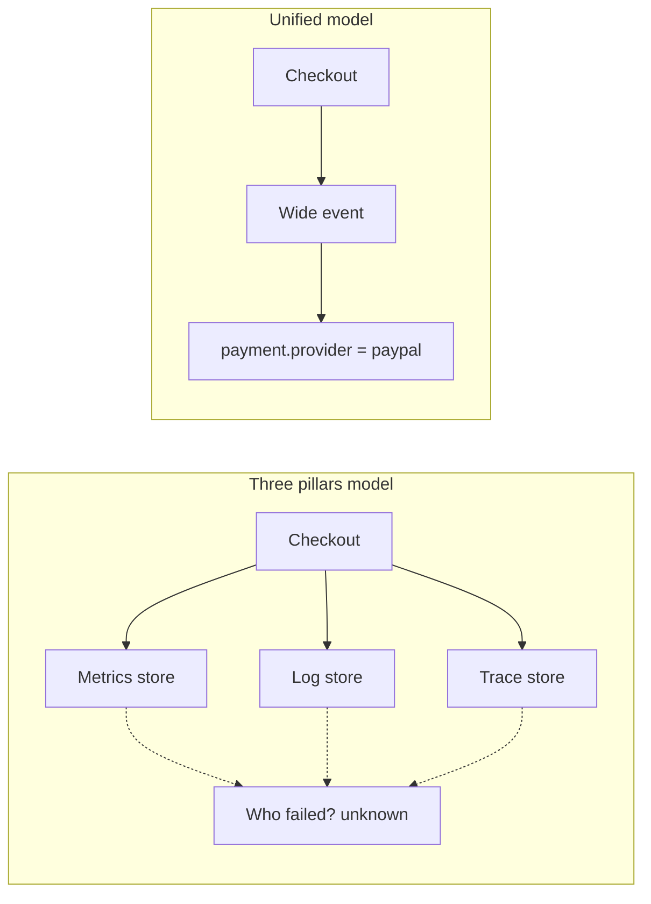
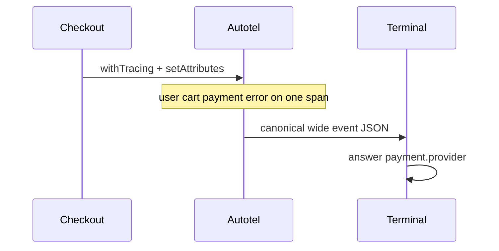

# Three pillars vs unified (newcomer demo)

**One sentence:** this app runs the same failed checkout twice so you can feel the difference between three separate telemetry piles and one wide event that keeps the whole story together.

Companion post (draft): [OpenTelemetry Is Not the Three Pillars](https://www.arrangeactassert.com/posts/otel-is-not-the-three-pillars/).

## What it checks

Neither mode narrates its own result. Each collects what it emitted as records
and runs the same search over them: find one record that names the user and
carries `payment.provider`. Pillars mode asserts that no record does, unified
mode asserts that one does and that the provider is the right one, so a run
exits non-zero the moment either claim stops being true.

## The filing-cabinet analogy

Think of a failed payment as a short story about one person and one cart.

**Three pillars mode** files that story into three cabinets:

1. **Metrics** — a summary chart ("checkout is a bit slow"). Useful, but the person's name never made it onto the chart.
2. **Logs** — sticky notes written at different times, with different spellings of the same field (`userId` vs `customer`).
3. **Traces** — a map of which function called which. Clear about _where_ time went. Quiet about _who_ and _which payment provider_.

To answer "which provider failed for Bob?" you open all three cabinets and glue the pieces yourself.

**Unified mode** keeps one dossier for that request: user, cart, payment provider, error code, and the call graph live together. You open one record and read the answer.



That dossier idea is what _Observability Engineering_ (2nd ed.) calls the **unified** model. The **three-pillars** model is the three-cabinet habit. OpenTelemetry is the _shipping method_ for telemetry, not a requirement to use three cabinets.

## Why two modes?

Same checkout. Same user (`user_456`). Same failure (`insufficient_funds` on PayPal).

| Script               | What you see                                   | Can you answer the question?       |
| -------------------- | ---------------------------------------------- | ---------------------------------- |
| `pnpm start:pillars` | Fake metric slice + scattered logs + bare span | No                                 |
| `pnpm start:unified` | One Autotel canonical wide event               | Yes: `payment.provider = "paypal"` |

The question both scripts ask at the end:

> Which `payment.provider` failed for `user_456`?

## Run

From the Autotel repo root (Node 24+, per the workspace engines):

```bash
pnpm install
pnpm --filter autotel build
cd apps/example-pillars-vs-unified
pnpm start:pillars
pnpm start:unified
```

No Docker. No API keys. Output prints to your terminal.

## Captured output

### `pnpm start:pillars`

Three stores, none of which name `payment.provider`:

```
--- METRICS STORE (aggregated; no individuals) ---
{
  "metric": "http.server.duration",
  "labels": { "route": "/api/checkout", "status": "500" },
  "p50": 89,
  "p99": 210
}

--- LOG STORE (scattered lines; inconsistent keys) ---
10:23:45.100 INFO  Checkout started userId=user_456
10:23:45.150 DEBUG Cart loaded cartId=cart-2 items=1
10:23:45.300 INFO  Payment processing method=paypal
10:23:45.612 ERROR Payment failed error=insufficient_funds customer=user_456

--- TRACE STORE (call graph; no product context) ---
{
  "name": "POST /api/checkout",
  "durationMs": 142,
  "status": "ERROR",
  "attributes": { "http.route": "/api/checkout", "http.response.status_code": 500 }
}

Question: Which payment.provider failed for user_456?
Answer:   unknown from this output alone.
7 records: 2 name the user (log store, log store), 0 carry payment.provider. No record has both.
```

`method=paypal` on a log line is the payment _method_, not the provider field the question asks for. The metric never saw the user. The span never saw the cart. The counts are computed from the records the mode emitted, so the "no" is measured rather than asserted by the narrator.

### `pnpm start:unified`

Autotel emits one canonical wide event (fields trimmed for reading; your terminal shows the full JSON including host/process metadata):

```json
{
  "user.id": "user_456",
  "user.subscription": "free",
  "cart.id": "cart-2",
  "cart.total_cents": 1999,
  "payment.method": "paypal",
  "payment.provider": "paypal",
  "error.type": "PaymentError",
  "error.code": "insufficient_funds",
  "http.route": "/api/checkout",
  "http.response.status_code": 500,
  "msg": "[HTTP POST /api/checkout] Request completed",
  "exception.message": "Payment failed: insufficient_funds"
}
```

```
Question: Which payment.provider failed for user_456?
Answer:   payment.provider = "paypal"
Read off one record in the wide event. No tab hopping.
```



## How to read the fields

| Field                         | Why it is there                                  |
| ----------------------------- | ------------------------------------------------ |
| `user.id` / email             | Who hit the bug                                  |
| `cart.id`, `cart.total_cents` | What they were buying                            |
| `payment.provider`            | The answer to the demo question                  |
| `error.type`, `error.code`    | Why it failed                                    |
| `traceId` / `spanId`          | Join to the call graph if you need deeper timing |

**Cardinality** (plain English): how many distinct values a field can take. `status=200|500` is low cardinality. `user.id` is high cardinality. High-cardinality fields are what let you find _this_ user later without planning that dashboard yesterday.

## Map to the book

From _Observability Engineering_, 2nd edition (Majors, Fong-Jones and Miranda, with Parker):

- Three pillars = **siloed stores**, not "having three signal types."
- That model fits **infra you did not write**. It is a weak fit for **code you own**.
- Unified observability keeps **wide, structured, high-cardinality** context so you pass what the book calls the arbitrary question test: "Can more engineers answer novel questions without escalating?"
- OpenTelemetry is the portable wire. Autotel is ergonomics on top of that wire so wide events are the default, not a weekend project.

## Where Autotel fits

```typescript
init({
  service: 'checkout-api',
  canonicalLogLines: { enabled: true, rootSpansOnly: true, logger },
});

const processCheckout = withTracing({})((ctx) => async (req) => {
  ctx.setAttributes({
    'payment.provider': 'paypal',
    'error.code': 'insufficient_funds',
  });
  // ...
});
```

You still export OTLP to Grafana, Honeycomb, Datadog, or whatever you choose. You stop treating three browser tabs as the investigation model for your own services.

## Next steps

- Deeper wide-event walkthrough: [`example-canonical-logs`](../example-canonical-logs)
- Chapter-by-chapter runnable asserts from the book: [`book-chapters`](../book-chapters)
- Probe → sense → respond loop: [`example-experiment`](../example-experiment)
