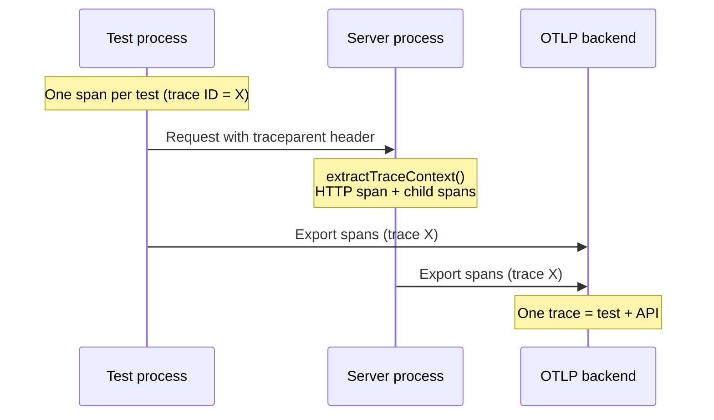

# autotel-playwright

Playwright fixture that gives each test an OpenTelemetry span and injects W3C trace context into HTTP requests to your API so **test → API** appears as one trace in your OTLP backend.

## How test and server appear as one trace

The test runs in the **Playwright worker process**; your API runs in another process (or on another host). The fixture injects a `traceparent` header into every request from `page` or `requestWithTrace` to your API. Your server uses `extractTraceContext()` (e.g. from `autotel/http`) and creates its spans in that context, so **the same trace ID** is used on both sides. In your OTLP backend, look up the test’s trace ID to see the full trace: test span, step spans, and all server spans (HTTP, handlers, `db.userId`, etc.).



## Install

```bash
pnpm add autotel autotel-playwright
```

Peer dependency: `@playwright/test`.

## Setup

### 1. Init autotel (globalSetup)

Call `autotel.init()` before tests run. In `playwright.config.ts`:

```ts
import { defineConfig } from '@playwright/test';
import { createGlobalSetup } from 'autotel-playwright';

export default defineConfig({
  globalSetup: createGlobalSetup({
    service: 'e2e-tests',
    debug: true,
    endpoint: process.env.OTLP_ENDPOINT,
  }),
  // ...
});
```

Or in a globalSetup file:

```ts
// globalSetup.ts
import { init } from 'autotel';

export default function globalSetup() {
  init({ service: 'e2e-tests', debug: true });
}
```

### 2. API base URL

Set one or both env vars so the fixture injects trace headers only into requests to your API:

- `API_BASE_URL` - e.g. `http://localhost:3000`
- `AUTOTEL_PLAYWRIGHT_API_ORIGIN` - same idea

If neither is set, tests still run; no route is added and no headers are injected.

### 3. Use the fixture in specs

**Browser (page):** requests made by the page to your API get trace context via the `page` fixture.

```ts
import { test, expect } from 'autotel-playwright';

test('health check', async ({ page }) => {
  await page.goto(process.env.API_BASE_URL + '/health');
  // Request to API_BASE_URL will include traceparent/tracestate and x-test-name
});
```

**Node (request):** use the `requestWithTrace` fixture for API calls from the test process (e.g. `request.get()`, `request.post()`). Same trace context is injected so test → API stays one trace.

```ts
test('api health from Node', async ({ requestWithTrace }) => {
  const res = await requestWithTrace.get(process.env.API_BASE_URL + '/health');
  expect(res.ok()).toBeTruthy();
});
```

**Step spans:** use the `step()` helper inside a test to create a child span for a logical step. Steps appear under the test span in the same trace.

```ts
import { test, expect, step } from 'autotel-playwright';

test('user flow', async ({ page }) => {
  await step('login', async () => {
    await page.fill('#email', 'user@example.com');
    await page.click('button[type=submit]');
  });
  await step('open dashboard', async () => {
    await page.goto('/dashboard');
  });
});
```

## Behaviour

- One span per test: name `e2e:${testInfo.title}`, attributes `test.title`, `test.file`, `test.line`, `test.project`.
- **page:** For every request whose URL matches the configured API base origin, the fixture adds W3C trace context and `x-test-name` to the request headers (via `page.route`).
- **requestWithTrace:** Same headers are merged into requests made with the wrapped `request` fixture (get/post/put/patch/delete/head/fetch) when the URL matches the API base.
- **step(name, fn):** Runs `fn` as a child span `step:${name}` under the test span for finer-grained traces. If `fn` throws, the span is marked as error with `recordException` before re-throwing.
- Optional per-test attributes: use annotations with type `autotel.attribute` and description `key=value` or semicolon-delimited `key1=value1;key2=value2` (see `AUTOTEL_ATTRIBUTE_ANNOTATION`).

## API

- **`test`** - Extended Playwright `test` with `page` (browser, trace context on matching requests) and `requestWithTrace` (Node APIRequestContext with trace context on matching URLs).
- **`step(name, fn)`** - Runs the async function as a named step; creates a child span so the trace shows test → step → … .
- **`expect`** - Re-exported from `@playwright/test`.
- **`createGlobalSetup(opts?)`** - Returns an async function that calls `autotel.init(opts)` for use as `globalSetup`.
- **`AUTOTEL_ATTRIBUTE_ANNOTATION`** - Annotation type string for custom span attributes (`key=value` in description).

### Optional: reporter (test + step spans from runner)

For test/step timing and hierarchy in OTLP from the **runner process** (separate from the worker's fixture spans), add the OTel reporter. You still need `init()` in globalSetup so reporter spans are exported.

```ts
// playwright.config.ts
import { defineConfig } from '@playwright/test';

export default defineConfig({
  reporter: [['list'], ['autotel-playwright/reporter']],
  globalSetup: './globalSetup.ts', // must call init()
});
```

Reporter creates one span per test (`e2e:${title}`) and one per step (`step:${title}`) as children. For a single trace that includes **test → API** (worker), use the fixture only; the reporter adds a parallel view from the runner.

## Configuration and troubleshooting

### API base URL with a path

When `API_BASE_URL` or `AUTOTEL_PLAYWRIGHT_API_ORIGIN` includes a path (e.g. `http://localhost:3000/api`), only requests whose path **starts with** that path receive trace headers. Same-origin requests to other paths (e.g. `http://localhost:3000/health`) do **not** get headers, so trace context is not leaked to unrelated endpoints.

### globalSetup must be a string

Playwright expects `globalSetup` to be a **path string** (e.g. `'./globalSetup.ts'`), not a function. Use a file that exports a default function which calls `init()`.

### Fixture spans vs reporter spans

- **Fixture** (worker): test span and `step()` spans run in the worker; requests to your API get trace context, so one trace = test → API. Call `init()` in a globalSetup **or** at the top of your spec so the worker process exports these spans.
- **Reporter** (runner): test and step spans from `onTestBegin` / `onStepBegin` run in the runner. Call `init()` in globalSetup so the runner exports reporter spans. Use Playwright’s `test.step()` to get step spans from the reporter.
