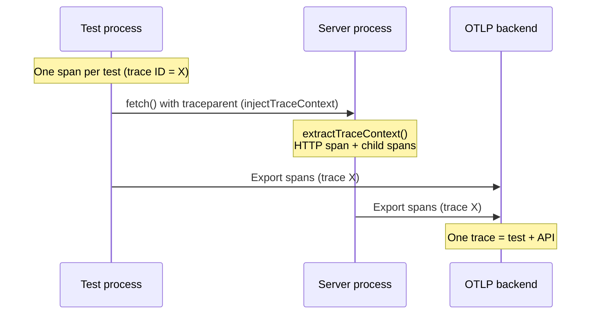

# autotel-vitest

`autotel-vitest` gives each Vitest test a parent OpenTelemetry span, so all `autotel` instrumented calls made during that test become child spans.

## How test and server appear as one trace

When you test an API over HTTP, the test runs in the **Vitest worker process** and the server runs in another process. Use `injectTraceContext()` from `autotel/http` so the request carries a `traceparent` header. Your server uses `extractTraceContext()` and creates its spans in that context, so **the same trace ID** is used on both sides. In your OTLP backend, look up the test’s trace ID to see the full trace: test span and all server spans (HTTP, handlers, `db.userId`, etc.). When you test in-process (no HTTP), all code runs in the same process and the fixture’s context automatically links test and handler spans in one trace.



## Install

Install `autotel-vitest`, `autotel`, and `vitest`:

```bash
# pnpm
pnpm add -D vitest
pnpm add autotel autotel-vitest

# npm
npm install --save-dev vitest
npm install autotel autotel-vitest

# yarn
yarn add --dev vitest
yarn add autotel autotel-vitest
```

## Quick Start

### 1. Initialize autotel in `globalSetup`

```ts
// globalSetup.ts
import { init } from 'autotel';

export default function globalSetup() {
  init({ service: 'unit-tests' });
}
```

### 2. Register `globalSetup` in Vitest config

```ts
// vitest.config.ts
import { defineConfig } from 'vitest/config';

export default defineConfig({
  test: {
    globalSetup: './globalSetup.ts',
  },
});
```

### 3. Import `test` from `autotel-vitest`

```ts
import { test, expect } from 'autotel-vitest';

test('creates user', async () => {
  await userService.createUser({ email: 'test@example.com' });
  expect(true).toBe(true);
});
```

The fixture is `auto: true`, so every test gets a parent span automatically.

## What You Get

- One span per test named `test:${task.name}`
- Span attributes: `test.name`, `test.file`, `test.suite`
- If a test throws, the span is marked as error and records the exception
- Any `trace()` / `span()` calls in the test flow become children of the active test span

## Optional: Reporter (runner-side spans)

Use the reporter when you also want runner-process spans for test/suite timing:

```ts
// vitest.config.ts
import { defineConfig } from 'vitest/config';

export default defineConfig({
  test: {
    globalSetup: './globalSetup.ts',
    reporters: ['default', 'autotel-vitest/reporter'],
  },
});
```

Reporter spans:

- test span: `test:${name}`
- suite span: `suite:${name}`

## Testing Utilities

`autotel-vitest` re-exports helpers from `autotel/testing`:

- `createTraceCollector`
- `assertTraceCreated`
- `assertTraceSucceeded`
- `assertTraceFailed`
- `assertNoErrors`
- `assertTraceDuration`
- `waitForTrace`
- `getTraceDuration`
- `createMockLogger`

Example:

```ts
import { test, createTraceCollector, assertTraceCreated } from 'autotel-vitest';

test('traces user creation', async () => {
  const collector = createTraceCollector();
  await userService.createUser({ email: 'test@example.com' });
  assertTraceCreated(collector, 'user.createUser');
});
```

## Troubleshooting

- No spans exported: verify `init()` runs in `globalSetup` before tests start.
- No child spans under test span: ensure your test imports `test` from `autotel-vitest`, not `vitest`.
- Reporter not running: ensure `reporters` includes `'autotel-vitest/reporter'`.

## API

- `test`: extended Vitest `test` with auto per-test span fixture
- `expect`, `describe`, `beforeEach`, `afterEach`, `beforeAll`, `afterAll`: re-exported from `vitest`
- `autotel/testing` helpers listed above: re-exported from this package
